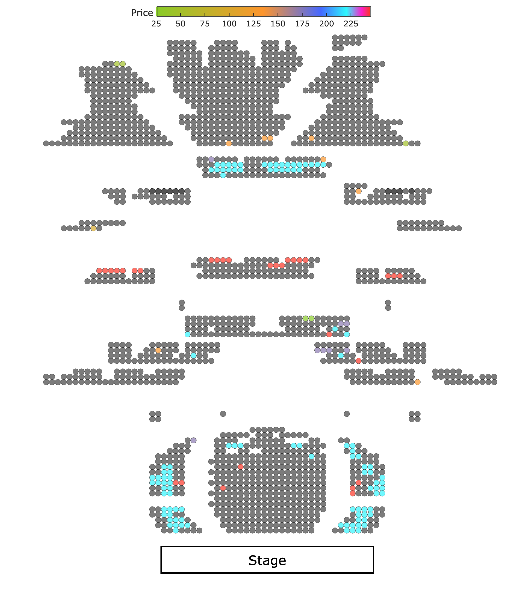
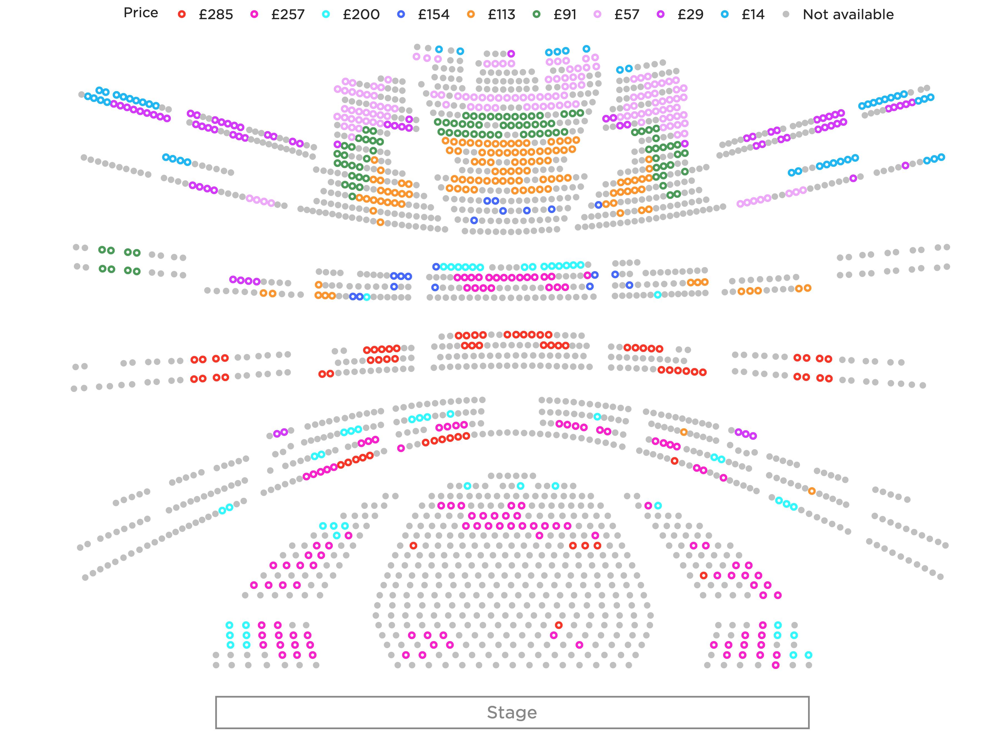

A data engineering project for ROH using their REST API.

It is deployed to Google Cloud as a Cloud Function, and a Cloud Run service via Docker container. Cloud Scheduler service is set up to call the Cloud Run several times a day to check for updated data from the API and store it in a Google Cloud Storage bucket. It also updates the **Upcoming events** plot below.

GCP services used: Cloud Function, Cloud Run, Cloud Scheduler, Cloud Storage, BigQuery, Firestore, Secret Manager.

The GCP-hosted Dash app is publicly available here: **https://artnosv.com/roh-events/**

In order to maintain a low profile, the documentation for this repository is limited. The code is not intended for public use.

---

# Upcoming events
<picture>
<source media="(prefers-color-scheme: dark)" srcset="https://storage.googleapis.com/vitaminb16-public/output/images/ROH_events_dark.png?">
<source media="(prefers-color-scheme: light)" srcset="https://storage.googleapis.com/vitaminb16-public/output/images/ROH_events.png?">

</picture>

---

# Seat availability
<!--  -->
<picture>
<source media="(prefers-color-scheme: dark)" srcset="output/images/ROH_hall_dark.png">
<source media="(prefers-color-scheme: light)" srcset="output/images/ROH_hall.png">

</picture>

<!-- 
TODO:
- [x] Add Firestore utils class to `cloud` module
- [x] Move titles_colour.json from Storage into Firestore
- [x] Store events data in Firestore during infrequent scheduled updates => read during frequent updates
- [ ] Convert plotly.express to plotly.graph_objects in `graphics.py` for better control over the plot
- [ ] Set up a dev GCP environment for testing new features before deploying to website
- [ ] Set up Terraform deployment for GCP
 -->
