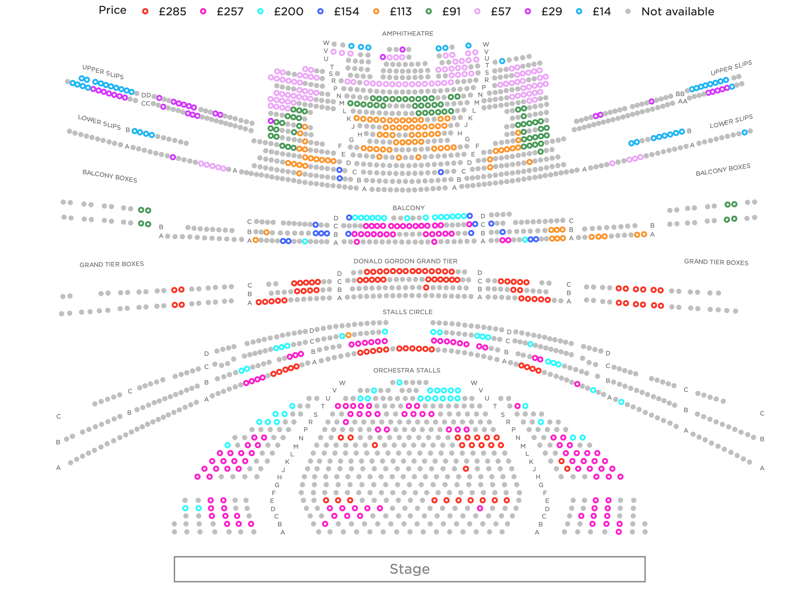

Set of utilities for my personal use for working with ROH REST API.

In order to maintain a low profile, the documentation for this repository is limited.

---

# Seat availability
<!--  -->
<picture>
<source media="(prefers-color-scheme: dark)" srcset="output/images/ROH_hall_dark.png">
<source media="(prefers-color-scheme: light)" srcset="output/images/ROH_hall.png">

</picture>

---

# Upcoming events
<picture>
<source media="(prefers-color-scheme: dark)" srcset="https://storage.googleapis.com/vitaminb16-public/output/images/ROH_events_dark.png">
<source media="(prefers-color-scheme: light)" srcset="https://storage.googleapis.com/vitaminb16-public/output/images/ROH_events.png">

</picture>